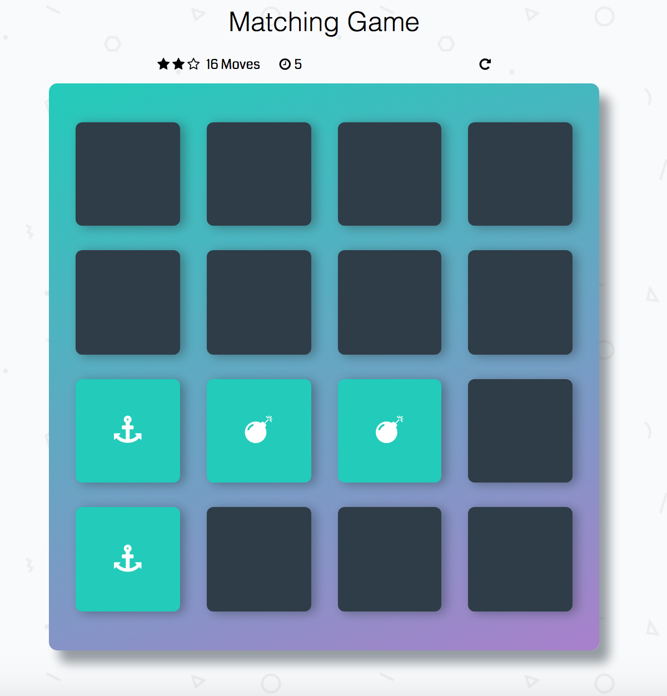

# Memory Game Project

## Description

It is a memory pairs game that has 16 cards (8 different pairs).The cards are shuffling randomly and the user can view 2 cards at a time. 

## How to play?

All you have to do is [clicking here](https://elhammj.github.io/MemoryGame/)

* Start to flip one card at a time
* Try to find its pair to match them
* You have to match all cards within 60 seconds
* Every time you flip 2 cards, the move counter increases by 1
* Once you start the game, you have 3 starts. If you move more than 15, you will lose one star, if you move more than 22 times, you will lose the second start. TRY TO WIN WITH 3 STARS ! 

